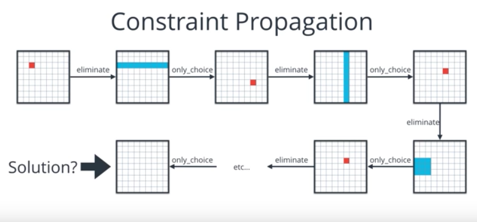

# Artificial Intelligence Nanodegree
## Introductory Project: Diagonal Sudoku Solver

# Question 1 (Naked Twins)
***Q: How do we use constraint propagation to solve the naked twins problem?***  


A:  Constraint propagation implements the same constraint as many times as possible until a solution is obtained, or the dead end where constraint can no longer be applied to refine the solution. In sudoku, we apply naked twins as local constraint to reduce the number of possibilities in the search space.


   The strategy is first to identify a pair of boxes(called ***naked twns***) belonging to the same set of peers that have the same 2 numbers as possibilities. Then secondly these two numbers are eleminated from the digit possibilities of all the boxes that have these two boxes as peers as shown in the code block below.
   
```
def naked_twins(values):
    """Eliminate values using the naked twins strategy.
    Args:
        values(dict): a dictionary of the form {'box_name': '123456789', ...}
    Returns:
        the values dictionary with the naked twins eliminated from peers.
    """

    # selecting boxes with 2 entries
    potential_twins = [box for box in values.keys() if len(values[box]) == 2]
    
    # Collecting boxes having the same elements
    naked_twins = [[box1,box2] for box1 in potential_twins \
                    for box2 in peers[box1] \
                    if set(values[box1])==set(values[box2]) ]

    # Going through naked twins,
    for i in range(len(naked_twins)):
        box1 = naked_twins[i][0]
        box2 = naked_twins[i][1]
        # Step -I: Finding intersection of peers
        peers_intersection = set(peers[box1]) & set(peers[box2])
        # Step-II: Delete the two digits in naked twins from all common peers.
        for peer_value in peers_intersection:
            if len(values[peer_value])>2:
                for remove_value in values[box1]:
                    values = assign_value(values, peer_value, values[peer_value].replace(remove_value,''))
    return values
 ```   


   Naked twins along with other strategy gives us the opportunity to enforce constraints in other parts of the grid(i.e. ***propagation of constraint***) that were previously unidentifiable, whether it is using the naked twins strategy again or a different strategy. These steps occurs in a chain and get us closer to a grid where each box only has one possible digit remaining, i.e., a solution as shown in figure below:




# Question 2 (Diagonal Sudoku)
***Q: How do we use constraint propagation to solve the diagonal sudoku problem?***

A: For diagonal sudoku, one can introduce two new diagonal units and add them to the unit list. On doing this all the diagonal entries will have the corresponding diagonal entries as their peers.Technically, two new constraints are created: 

   * the digits 1-9 must appear only once in each of these new diagonal units,
   * each box along the diagonal now belongs to another unit and now has new peers. 
   
``` dig1,dig2 ```  are two diagonal units in the code block below:

```
   
boxes = cross(rows, cols)

row_units = [cross(r, cols) for r in rows]
column_units = [cross(rows, c) for c in cols]
square_units = [cross(rs, cs) for rs in ('ABC','DEF','GHI') for cs in ('123','456','789')]
dig1_units = [[rows[i]+cols[i] for i in range(len(rows))]]
dig2_units = [[rows[i]+cols_rev[i] for i in range(len(rows))]]

unitlist = row_units + column_units + square_units + dig1_units + dig2_units

units = dict((s, [u for u in unitlist if s in u]) for s in boxes)
peers = dict((s, set(sum(units[s],[]))-set([s])) for s in boxes)
    

```

   Finally,the strategies like: elimination, only choice, and naked twins do not change on adding diagonal units. There is just another set of constraints to enforce. More specifically, more units and peers of which to be aware. We continue the process of enforcing a constraint to reduce the search space to enforce more constraints to find a solution.


------------------


### Install

This project requires **Python 3**.

We recommend students install [Anaconda](https://www.continuum.io/downloads), a pre-packaged Python distribution that contains all of the necessary libraries and software for this project. 
Please try using the environment we provided in the Anaconda lesson of the Nanodegree.

##### Optional: Pygame

Optionally, you can also install pygame if you want to see your visualization. If you've followed our instructions for setting up our conda environment, you should be all set.

If not, please see how to download pygame [here](http://www.pygame.org/download.shtml).

### Code

* `solution.py` - You'll fill this in as part of your solution.
* `solution_test.py` - Do not modify this. You can test your solution by running `python solution_test.py`.
* `PySudoku.py` - Do not modify this. This is code for visualizing your solution.
* `visualize.py` - Do not modify this. This is code for visualizing your solution.

### Visualizing

To visualize your solution, please only assign values to the values_dict using the ```assign_values``` function provided in solution.py

### Submission
Before submitting your solution to a reviewer, you are required to submit your project to Udacity's Project Assistant, which will provide some initial feedback.  

The setup is simple.  If you have not installed the client tool already, then you may do so with the command `pip install udacity-pa`.  

To submit your code to the project assistant, run `udacity submit` from within the top-level directory of this project.  You will be prompted for a username and password.  If you login using google or facebook, visit [this link](https://project-assistant.udacity.com/auth_tokens/jwt_login for alternate login instructions.

This process will create a zipfile in your top-level directory named sudoku-<id>.zip.  This is the file that you should submit to the Udacity reviews system.

